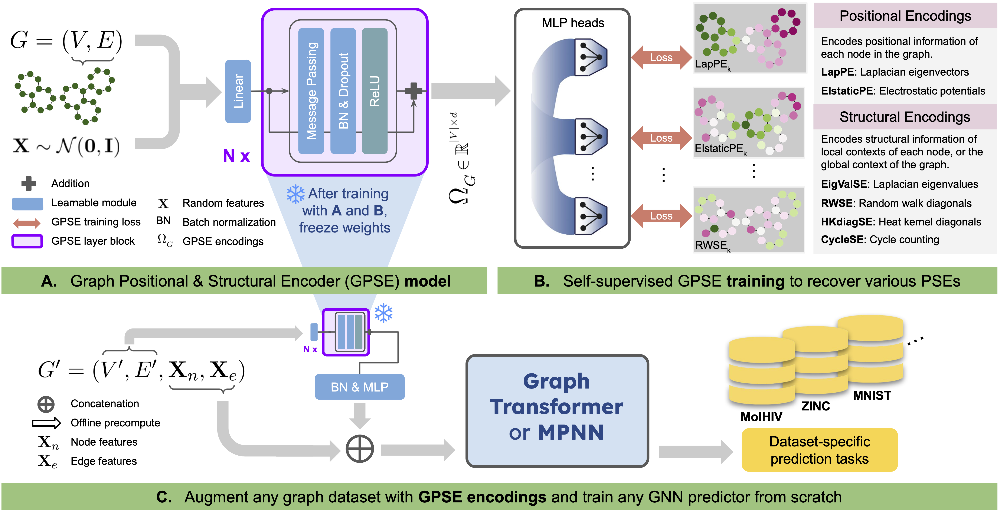

# GPSE: Graph Positional and Structural Encoder

#### [Semih Cantürk*](https://semihcanturk.github.io), [Renming Liu*](https://github.com/RemyLau), Olivier Lapointe-Gagné, Vincent Létourneau, Guy Wolf, Dominique Beaini, Ladislav Rampášek

[_Accepted at ICML 2024_](https://proceedings.mlr.press/v235/canturk24a.html)

[](https://arxiv.org/abs/2307.07107)



## PyG Integration
Downstream GPSE usage is currently being integrated into PyG.
You can follow the progress [in this issue](https://github.com/pyg-team/pytorch_geometric/issues/8310) and [this PR](https://github.com/pyg-team/pytorch_geometric/pull/9018). If you do not want to wait for the PR to be merged, you can also install PyG through the GPSE-implemented fork with: 
```
pip install git+https://github.com/semihcanturk/pytorch_geometric.git
```


## Installation

This codebase is built on top of
[GraphGym](https://pytorch-geometric.readthedocs.io/en/2.0.0/notes/graphgym.html)
and [GraphGPS](https://github.com/rampasek/GraphGPS). Follow the steps below to
set up dependencies, such as [PyTorch](https://pytorch.org/) and
[PyG](https://pytorch-geometric.readthedocs.io/en/latest/):

```bash
# Create a conda environment for this project
conda create -n gpse python=3.10 -y && conda activate gpse

# Install main dependencies PyTorch and PyG
conda install pytorch=1.13 torchvision torchaudio pytorch-cuda=11.7 -c pytorch -c nvidia -y
conda install pyg=2.2 -c pyg -c conda-forge -y
pip install pyg-lib -f https://data.pyg.org/whl/torch-1.13.0+cu117.html

# RDKit is required for OGB-LSC PCQM4Mv2 and datasets derived from it.  
conda install openbabel fsspec rdkit -c conda-forge -y

# Install the rest of the pinned dependencies
pip install -r requirements.txt

# Clean up cache
conda clean --all -y
```

## Quick start

### Download the pre-trained GPSE model or pre-train it from scratch

The pre-trained GPSE encoder can be downloaded from Zenodo 
[](https://doi.org/10.5281/zenodo.8145344)

```bash
# Pre-trained on MolPCBA (default)
wget https://zenodo.org/record/8145095/files/gpse_model_molpcba_1.0.pt -O pretrained_models/gpse_molpcba.pt

# Pre-trained on ZINC
wget https://zenodo.org/record/8145095/files/gpse_model_zinc_1.0.pt -O pretrained_models/gpse_zinc.pt

# Pre-trained on PCQM4Mv2
wget https://zenodo.org/record/8145095/files/gpse_model_pcqm4mv2_1.0.pt -O pretrained_models/gpse_pcqm4mv2.pt

# Pre-trained on GEOM
wget https://zenodo.org/record/8145095/files/gpse_model_geom_1.0.pt -O pretrained_models/gpse_geom.pt

# Pre-trained on ChEMBL
wget https://zenodo.org/record/8145095/files/gpse_model_chembl_1.0.pt -O pretrained_models/gpse_chembl.pt
```

You can also pre-train the GPSE model from scratch using the configs provided, e.g.

```bash
python main.py --cfg configs/pretrain/gpse_molpcba.yaml
```

After the pre-training is done, you need to manually move the checkpointed model to the `pretrained_models/` directory.
The checkpoint can be found under `results/gpse_molpcba/<seed>/ckpt/<best_epoch>.pt`, where `<seed>` is the random seed
for this run (0 by default), and `<best_epoch>` is the best epoch number (you will only have one file, that *is* the
best epoch).

### Run downstream evaluations

After you have prepared the pre-trained model `gpse_molpcba.pt`, you can then run downstream evaluation for models that
uses `GPSE` encoded features. For example, to run the `ZINC` benchmark:

```bash
python main.py --cfg configs/mol_bench/zinc-GPS+GPSE.yaml
```

You can also execute batch of runs using the run scripts prepared under `run/`. For example, to run all molecular
property prediction benchmarks (`ZINC-subset`, `PCQM4Mv2-subset`, `ogbg-molhiv`, and `ogbg-molpcba`)

```bash
sh run/mol_bench.sh
```

## Generating embedding visualizations

This part is for generating the embedding PCA plots in appendix E, Fig. E2.
The plots here show how random initial node features enable breaking symmetries in otherwise 1-WL indistinguishable graphs.
By default, the embeddings are generated by `gnn_encoder.py` drawn from random normals (see line 32).
To compare with identical input features (e.g. 1), we return a `np.ones` array of size `(n, dim_in)`, instead of `np.random.normal`.
Running the code below with and without the changes described above will result in two `.pt` files of the embeddings.
The code and further instructions to generate the visualizations are found in `viz/wl_viz.ipynb`.
```
python viz/wl_test.py --cfg configs/wl_bench/toywl-GPS+GPSE_v9.yaml
```

## Known issues

- Incompatibility with PyG 2.4.0 due to a minor bug in the GraphGym MLP construction (see https://github.com/G-Taxonomy-Workgroup/GPSE/issues/1 and https://github.com/pyg-team/pytorch_geometric/issues/8484).

## Citation

If you find this work useful, please cite our paper

```bibtex
@InProceedings{pmlr-v235-canturk24a,
  title = 	 {Graph Positional and Structural Encoder},
  author =       {Cant\"{u}rk, Semih and Liu, Renming and Lapointe-Gagn\'{e}, Olivier and L\'{e}tourneau, Vincent and Wolf, Guy and Beaini, Dominique and Ramp\'{a}\v{s}ek, Ladislav},
  booktitle = 	 {Proceedings of the 41st International Conference on Machine Learning},
  pages = 	 {5533--5566},
  year = 	 {2024},
  editor = 	 {Salakhutdinov, Ruslan and Kolter, Zico and Heller, Katherine and Weller, Adrian and Oliver, Nuria and Scarlett, Jonathan and Berkenkamp, Felix},
  volume = 	 {235},
  series = 	 {Proceedings of Machine Learning Research},
  month = 	 {21--27 Jul},
  publisher =    {PMLR},
  pdf = 	 {https://raw.githubusercontent.com/mlresearch/v235/main/assets/canturk24a/canturk24a.pdf},
  url = 	 {https://proceedings.mlr.press/v235/canturk24a.html},
  abstract = 	 {Positional and structural encodings (PSE) enable better identifiability of nodes within a graph, rendering them essential tools for empowering modern GNNs, and in particular graph Transformers. However, designing PSEs that work optimally for all graph prediction tasks is a challenging and unsolved problem. Here, we present the Graph Positional and Structural Encoder (GPSE), the first-ever graph encoder designed to capture rich PSE representations for augmenting any GNN. GPSE learns an efficient common latent representation for multiple PSEs, and is highly transferable: The encoder trained on a particular graph dataset can be used effectively on datasets drawn from markedly different distributions and modalities. We show that across a wide range of benchmarks, GPSE-enhanced models can significantly outperform those that employ explicitly computed PSEs, and at least match their performance in others. Our results pave the way for the development of foundational pre-trained graph encoders for extracting positional and structural information, and highlight their potential as a more powerful and efficient alternative to explicitly computed PSEs and existing self-supervised pre-training approaches. Our framework and pre-trained models are publicly available at https://github.com/G-Taxonomy-Workgroup/GPSE. For convenience, GPSE has also been integrated into the PyG library to facilitate downstream applications.}
}
```
